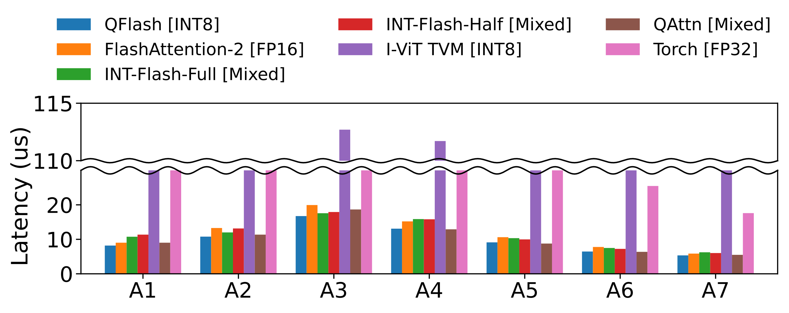

# [IJCAI'26] QFlash

Integer-only FlashAttention kernel in Triton — **official implementation**.

> **QFlash: Bridging Quantization and Memory Efficiency in Vision Transformer Attention**
> Sehyeon Oh, Yongin Kwon, Jemin Lee — IJCAI-ECAI 2026

## Install

```bash
pip install git+https://github.com/EfficientCompLab/qflash.git
```

Tested with PyTorch 2.7.1 (CUDA 12.8) on NVIDIA RTX 5090.

## Usage

Kernel-level workloads (latency, SQNR on A1–A7):

```bash
python benchmark.py
```

Reference SQNR:


| Workload      | SQNR         | 
| ------------- | ------------ |
| A2 (ViT/DeiT) | **32.50 dB** | 
| A7 (Swin)     | **31.02 dB** | 

Full per-workload latency comparison across A1–A7:



ImageNet Top-1 on the seven paper models:

```bash
python validate.py --all                         # ~/dataset/imagenet by default
python validate.py -m DeiT-T --num-samples 1000   # quick sanity
```

Reference Top-1 from the paper:

| Model (FP32)   | QFlash    |
| -------------- | --------- |
| ViT-S (81.38)  | **82.24** |
| ViT-B (85.10)  | **86.84** |
| DeiT-T (72.21) | **71.70** |
| DeiT-S (79.85) | **79.46** |
| DeiT-B (81.85) | **81.59** |
| Swin-T (81.35) | **80.06** |
| Swin-S (83.20) | **81.86** |


## Citation

```bibtex
@inproceedings{oh2026qflash,
  title     = {QFlash: Bridging Quantization and Memory Efficiency in Vision Transformer Attention},
  author    = {Oh, Sehyeon and Kwon, Yongin and Lee, Jemin},
  booktitle = {Proceedings of the Joint Conference on Artificial Intelligence and European Conference on Artificial Intelligence (IJCAI-ECAI)},
  year      = {2026},
}
```